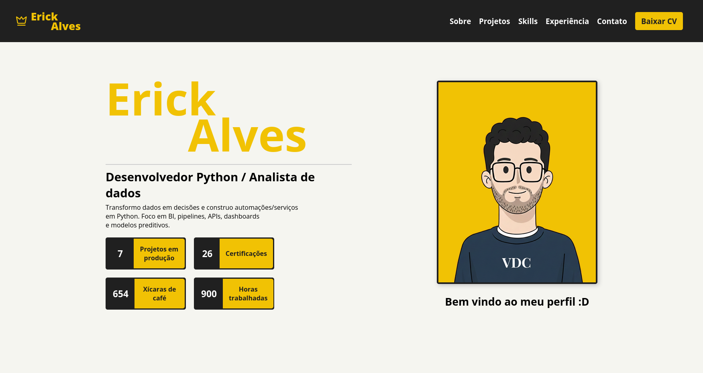

# Portfolio erick alves

### Requisitos
- nvm
- node.js
- browser

### Como rodar o projeto ?
- rode o comando: `nvm install ; nvm use` em seu terminal
- apos isso, rode o comando `npm install` para instalar as dependencias
- `npm run dev` para rodar o projeto na url http://localhost:5173

### Powered by
- ViteJS
- VueJS
- Coffee
